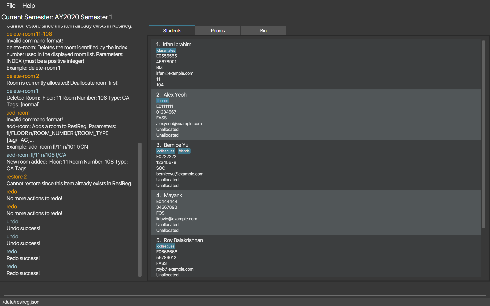
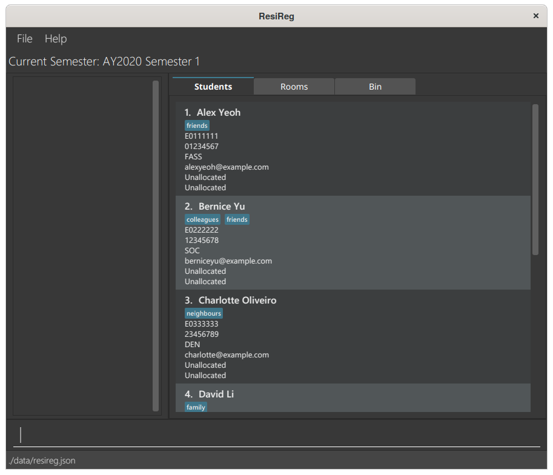
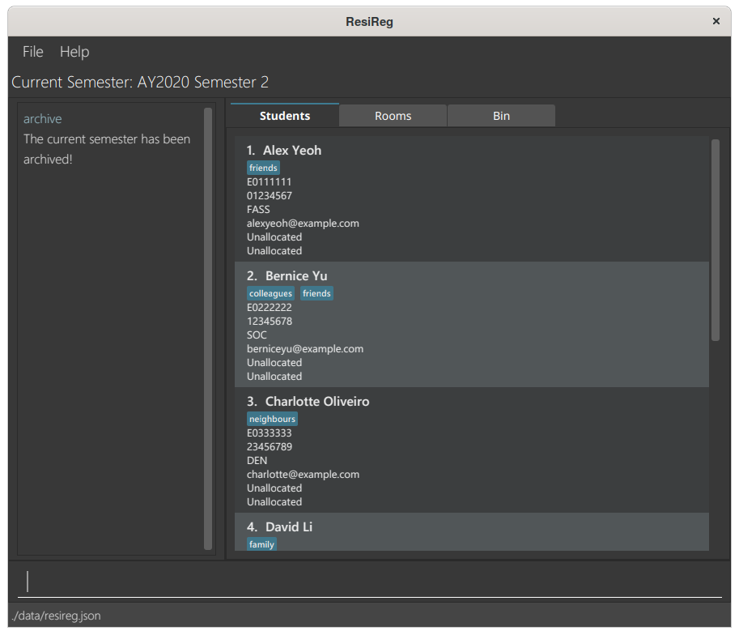
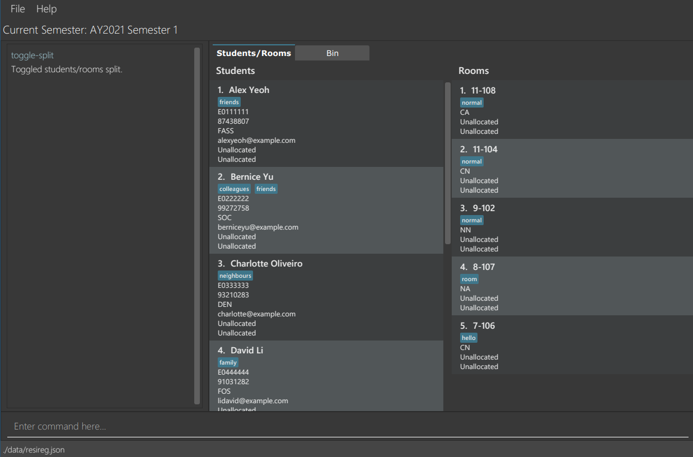
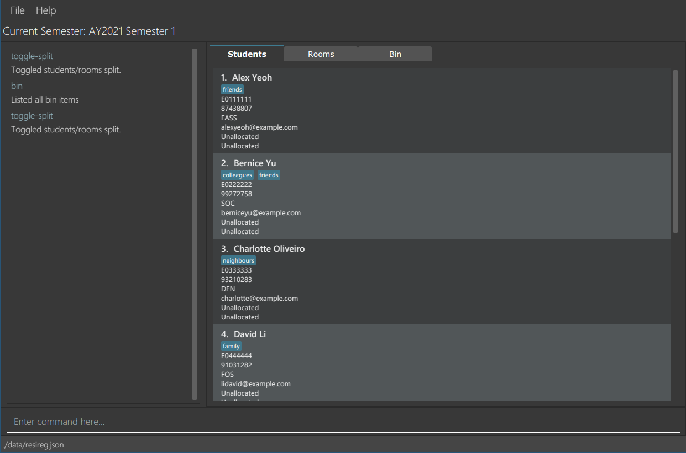

* Table of Contents
{:toc}

## Introduction

**ResiReg** (**Res**idential **Reg**ulation) is a productivity app designed to help admin staff at Residential Colleges (RCs)\* in NUS with their daily tasks. ResiReg allows admin to allocate rooms to students, manage students records, generate billing and OHS reports, and export CSVs for easy reference and sharing.

**ResiReg** has the following main features:

- Manage records of students.
- Manage records of rooms.
- Manage allocations of students to rooms in the College.

**ResiReg** is optimised for OHS admin who are fast typists who are used to MS Excel, and prefer typing over other means of input. It comes with:

- A Command Line Interface (CLI) which allows you to access all **ResiReg** features by typing.
- A Graphical User Interface (GUI) that displays the information you need in a grid format.

> **ResiReg** is currently a work in progress. Here is a mockup of its skeleton. Stay tuned for our progress!
> 

## About this Guide

### Basic Information

This User Guide explains how you (as an OHS admin) can use **ResiReg** to manage tasks at Residential Colleges.

You may refer to [Quick Start](#quick-start) for a short tutorial on how to run **ResiReg** on your system and use **ResiReg**'s main features. For a full walkthrough of **ResiReg**, please refer to [Features](#features).

## Quick Start

> **ResiReg** runs on Windows, Linux, and OS-X.

1. Ensure that Java 11 or above is installed in your computer.
2. Download the latest `ResiReg.jar` here.
3. Copy the file to the folder you want to use as the home folder for your **ResiReg**.
4. Double-click the file to start the app. The app window should open in a few seconds.
5. Type the command in the command box and press <kbd>Enter</kbd> to execute it. e.g. typing `help` and pressing Enter will open this user guide.
6. Some example commands you can try:
   - `rooms --vacant`: lists all rooms that are vacant.
   - `allocate si/1 ri/2`: allocates the 1st student in the student list to the 2nd room in the room list.
   - `exit`: exits the app.
7. Refer to “Features” for details of all the commands.

## Command Format

<div markdown="block" class="alert alert-info">
This section explains the format of commands in this User Guide.

- Words in `<angular_brackets>` are the parameters to be supplied by the user e.g. in `deallocate <student_name>`, `<student_name>` is a parameter which can be used as `deallocate Jet New`.
- Items in square brackets are optional e.g `<full_name> [-aka <alias>]` can be used as `Jet New -aka JJ` or as `Jet New`.
- Items separated by <Code>or</Code> indicates a choice between items, but only one item is to be used at any time e.g. `--vacant or --allocated` means either the `--vacant` or the `--allocated` flag (but not both) can be used.
- Items with `…` after them can be used multiple times including zero times, unless otherwise stated e.g. `[/m <mod> /ig <interest_group>]…` can be used as `/m mod /ig ig`, `/m mod1 /ig ig1 /m mod2 /ig ig2` etc.
</div>

### Housing Management

> **ResiReg** allows you to manage rooms in the Residential College.

#### Listing and filtering rooms : `rooms`

Switches to the room tab if it is not already selected and shows a list of rooms in ResiReg, optionally filtered by some criteria.

Format: `rooms [--vacant or --allocated] [fl/<floor>]... [n/<room_number>]... [t/<room_type>]...`
- If no parameters are given, all rooms are shown.
- `--allocated` shows all rooms that have been allocated to a student, while `--vacant` shows all vacant rooms.
- Rooms can be filtered by multiple criteria. Criteria of the same type (eg. floors) are combined using "or" while criteria of different types are combined using "and". See the section below for some examples.

Examples:

- `rooms` shows all rooms 
- `rooms fl/11` shows all rooms on floor 11.
- `rooms --vacant fl/11 fl/12 t/CN` shows all vacant rooms of type corridor non-aircon which are on either floor 11 or floor 12.

#### Adding a room: `add-room`

Adds a room to ResiReg. The following room details are stored: room floor, room number, room type, and optionally, tags.

Format: `add-room fl/<floor> n/<room_number> t/<room_type> [tag/<tag_name>]...`
- Floor must be an integer
- Room number must be an integer
- Room type must be one of the following values: `CA` (corridor, aircon), `CN` (corridor, non-aircon), `NA` (non-corridor, aircon), `NN` (non-corridor, non-aircon)
- The room will not be added if any piece of required information is missing. An error message will be displayed instead.

Examples:
- `add-room fl/12 n/112 t/CA` adds the room #12-112 of type corridor aircon.

#### Deleting a room: `delete-room`

Deletes the specified room from ResiReg.

Format: `delete-room <index>`
- Deletes the room at the specified `index`, and moves the room to the bin.
- The index refers to the index number shown in the displayed room list.

#### Editing rooms: `edit-room`

Edits an existing room in ResiReg.

Format `edit-room <index> [fl/<floor>] [n/<room_number>] [t/<room_type>] [tag/<tag_name>]...`
- Edits the room at the specified `index`. The index refers to the index number shown in the currently displayed room list.
- Constraints on floor, room number and room type are specified under `add-room`.

Examples:
- `edit-room 1 t/CN` Changes the room type of the 1st room to `CN`

#### Allocating a room to a student : `allocate`

Allocates a room to a student i.e denotes that the student currently occupies the room.

Format: `allocate ri/<room_index> si/<student_index>`

- Allocates a room to the student person at the specified `room_index` and `student_index`. The `room_index` refers to the index number shown in the displayed rooms list,
  and the `student_index` refers to the index number shown in the displayed students list. Both indices **must be positive integers** 1, 2, 3, …​
- Both the student and the room must be unallocated when this command is run. Otherwise, an error message is displayed accordingly.

Examples:

- `allocate ri/1 si/1` allocates the room at `room_index` 1 to the student at `student_index` 1.

#### Deallocating a room for a student : `deallocate`
##### Before allocation


##### After allocation


Deallocates a room for a student i.e denotes that the student no longer occupies the room.

Format: `deallocate si/<student_index>`
* Deallocates a room to the student at the specified `student_index`. The `student_index` refers to the index number shown in the displayed students list. The `student_index` **must be positive a integer** 1, 2, 3, …​
* The student at `student_index` must have been allocated a room. Otherwise, an error message is displayed.

Examples:
* `deallocate si/1` deallocates the room for the student at `student_index` 1.

##### Before deallocation
Refer to "After allocation" above.

##### After deallocation


#### Reallocating a room for a student : `reallocate`

Reallocates a room for a student, by editing the allocation relating a student to its current room.

Format: `reallocate si/<student_index> ri/<room_index>`

* Reallocates the room at `room_index` to the student at the specified `student_index`. The `room_index` refers to the
 index number shown in the displayed rooms list, and the `student_index` refers to the index number shown in the 
 displayed students list. Both indices **must be positive integers** 1, 2, 3, …​
* The student at `student_index` must currently have a room allocation (which is not the specified room). Otherwise, an error message is displayed accordingly. 
* The room at `room_index` must currently be vacant. Otherwise, an error message is displayed accordingly. 

Examples:
* `reallocate si/1 ri/2` edits the allocation of the student with index 1's current room to the room with index 2.

##### Before reallocation
Refer to "After allocation" above.

##### After reallocation


### Data Management

> **ResiReg** allows you to manage allocations on a per-Semester basis.

#### Archiving a Semester: `archive`

Archives the previous semester's data into an archival folder, and adjusts the application to operate on the succeeding semester.

Format: `archive`

- Moves the previous semester's allocation data to `AY[YEAR]S[SEMESTER]/archive.json`. For example, if the previous semester was 2019 Semester 2, the allocation data will be moved to `AY2019S2/archive.json`.
- The rooms and students are still preserved in the system.

##### Before archival



##### After archival




### Student Management

> **ResiReg** allows you to manage students in the Residential College.

#### Listing all students : `students`

Shows a list of all students in ResiReg, optionally filtered by some parameters.

Format: `students [n/<name>] [p/<phone>] [e/<email>] [f/<faculty] [i/<student_id>]`

Examples:

- `students` switches to the Students tab if it is not already selected, and shows the list of students on the right pane.
- `students n/dameeth` switches to the Students tab if it is not already selected, and shows the list of students matching the name "dameeth" on the right pane.

#### Adding a student : `add-student`

Adds a student to ResiReg. The following student details are stored: name, student ID, phone, email, faculty, and optionally, tags.

Format: `add-student n/<student_name> i/<student_id> p/<8_digit_phone_no> e/<email> f/<faculty> [tag/<tag_name>]...`

- The student ID must be a 8-digit alphanumeric string, starting with `EO` and ending with 6 digits. It must be unique (no two students in ResiReg can share the same student ID). Otherwise, an error message is displayed accordingly.
- The pairs of type-prefixes and data (eg. `n/<student_name>`) may given be in any order.
- The student will not be added if some pieces of information is missing. An error message will be displayed instead.

Examples:

- `add-student n/Jet New i/E0407889 p/82462157 e/jn@u.nus.edu f/SOC` successfully creates a new student named Jet New whose student ID is E0407889, phone number is 82462157,
  email is jn@u.nus.edu, and faculty is Computing (SOC).
- `add-student n/Jet New i/E0407889 e/jn@u.nus.edu` prompts the user with the following error message (because the faculty field is missing):
  `Invalid command format! add-student: Adds a student to ResiReg. Parameters: n/NAME i/STUDENT_ID p/PHONE e/EMAIL f/FACULTY [tag/TAG]... Example: add-student n/John Doe s/E0123456 p/98765432 e/johndoe@u.nus.edu f/FASS`

#### Editing a student : `edit-student`

Edits an existing student in ResiReg.

Format: `edit-student <index> [n/<student_name>] [i/<student_id>] [p/<8_digit_phone_no>] [e/<email>] [f/<faculty>] [tag/<tag_name>]…​`

- Edits the person at the specified `index`. The index refers to the index number shown in the displayed student list. The index **must be a positive integer** 1, 2, 3, …​
- At least one of the optional fields must be provided.
- Existing values will be updated to the input values.
- When editing tags, the existing tags of the student will be removed i.e adding of tags is not cumulative.
- You can remove all of the student’s tags by typing `tag/` without specifying any tags after it.

Examples:

- `edit-student 1 p/82462157 e/johnd@comp.nus.edu.sg` Edits the phone number and email address of the first student to be `82462157` and `johnd@comp.nus.edu.sg` respectively.
- `edit-student 2 n/Alpha Queue tag/` Edits the name of the 2nd student to be `Alpha Queue` and clears all existing tags.

#### Deleting a student : `delete-student`

Deletes the specified student from ResiReg.

Format: `delete-student <index>`

- Deletes the student at the specified `index`, and moves the student to the bin.
- The index refers to the index number shown in the displayed student list.
- The index **must be a positive integer** 1, 2, 3, …​

Examples:

- `students` followed by `delete-student 2` deletes the 2nd student in ResiReg.
- `students n/Roy` followed by `delete-student 1` deletes the 1st student (if any) in the results of the `students` command.

<div markdown="span" class="alert alert-primary">:bulb: **Tip:**
If you delete a student erroneously, you should undo the command immediately. However, if you deleted the student a while ago, and wish to restore it, then you should use the restore command (see below).
</div>

### General

> **ResiReg** has many general features such as Command Line Interface (CLI) sugar and a recyling bin for more efficient usage by experienced users.

#### Listing all bin items : `bin`

Shows a list of all bin items in ResiReg.

Format: `bin`

- `bin` switches to the Bin tab if it is not already selected.

Examples: `bin`

#### Restoring a bin item : `restore`

Restores an existing bin item in ResiReg.

Format: `restore <index>`

- Restores the bin item at the specified `index` to the list it was originally deleted from (e.g. student list). The index refers to the index number shown in the displayed bin item list. The index **must be a positive integer** 1, 2, 3, …​

Examples:

- `restore 1` restores the first bin item in the list, to its original list.

#### Set bin expiry time : `set-bin-expiry`

Sets the amount of time (in days) that bin items stay in the bin before they are permanently removed.

<div markdown="span" class="alert alert-primary">:bulb: **Tip:**
The default time for which a bin item stays in the bin is **30 days**. Use this command if this does not suit your needs.
</div>

Format: `set-bin-expiry <number_of_days>​`

- `<number_of_days>` **must be a positive integer** 1, 2, 3, …​

Examples:

- `set-bin-expiry 20` sets all bin items to be permanentely removed 20 days after their deletion.

#### Listing all aliases : `aliases`

Shows the list of aliases (an alias is a user-defined term that can be used interchangeably with a command word) and their corresponding command words currently in ResiReg.

Format: `aliases​`

Example: `aliases`

#### Adding an alias : `alias`

Adds an alias for a command word to ResiReg.

Format: `alias c/<command_word> a/<alias_term>​`

- `<command_word>` must exactly match one of the command words listed by the `help` command.
- `<alias_term>` cannot be an existing command word, or an existing alias.

Examples:

- `alias c/set-bin-expiry a/sb` adds an alias `sb` for the `set-bin-expiry` command. Henceforth, `sb` and `set-bin-expiry` command will have the same effect
- `alias c/rooms a/r` adds an alias `r` for the `rooms` command. Henceforth, `r` and `rooms` command will have the same effect. Note that filtering flags such as `--allocated` and `--vacant` remain unchanged.

#### Deleting an alias : `dealias`

Deletes an alias for a command word to ResiReg.

Format: `dealias c/<command_word> a/<alias_term>​`

- Both `<command_word>` and `<alias_term>` must exactly match one of the command word-alias pairs listed by the `aliases` command.

Examples:

- `dealias c/set-bin-expiry a/sb` removes the an alias `sb` for the `set-bin-expiry` command. Henceforth, typing `sb` will lead to an error message.

#### Asking for help as a first time user : `help`

Shows a list of all available commands and their purpose to understand the usage of the commands.

Format: `help`

- Lists all user commands and their purpose.
- Also includes a link to this User Guide, so that the user can access further details.

Examples:

```
Commands available:
add-room: Adds a room to ResiReg.
add-student: Adds a student to ResiReg.
allocate: Allocates a student to a room.
clear: Clears list of students.
...other commands...

You can also refer to our user guide at: https://ay2021s1-cs2103-t16-3.github.io/tp/UserGuide.html
```

#### Checking the syntax for a command

Shows the purpose, syntax, and parameters of a command if you need to use the command but are unsure of its syntax.

Format: `help <command_word> or <alias>`

- `<command_word>` if supplied, should exactly match one of the command words listed by the `help` command
- `<alias>` if supplied, should exactly match one of the aliases listed by the `aliases` command

Examples:

- `help rooms` results in the following output:

```
rooms: Lists all rooms within the system. If the --vacant flag is specified, lists only vacant rooms i.e rooms which have no students allocated to them.
Otherwise, if the --allocated flag is specified, lists only allocated rooms i.e. rooms which have students allocated to them.
Parameters: [--vacant or --allocated]
Example: rooms
```

#### Clearing all entries : `clear`

Clears all entries (students, rooms, allocations and bin items) from ResiReg.

Format: `clear`

#### Undo previous command : `undo`
Restores the address book to the state before 
the previous state modifying command was executed.

<div markdown="span" class="alert alert-info">:information_source: Pressing the <kbd>ctrl-z</kbd> keyboard combination
in the command box will execute the command as well.
</div>

#### Redo previous undo command : `redo`
Reverses the most recent undo command.

<div markdown="span" class="alert alert-info">:information_source: Pressing the <kbd>ctrl-y</kbd> keyboard combination
in the command box will execute the command as well.
</div>

<div markdown="span" class="alert alert-primary">:bulb: **Tip:**
`undo` and `redo` support the undoing and redoing respectively of commands
that change the state of ResiReg, which comprises of: students, rooms, allocations, semesters and bin items.
</div>

#### List previously entered commands : `history`
Lists all the commands previously entered in reverse chronological order.

<div markdown="span" class="alert alert-info">:information_source: Pressing the <kbd>up</kbd> and <kbd>down</kbd> arrows will 
display the previous and next command respectively in the command box.

</div>

#### Exiting ResiReg : `exit`
Exits the program.

Format: `exit`

#### View students and rooms side by side: `toggle-split`
While allocating rooms to students, it is probably easier to view rooms and students at the same time. If the rooms and students tabs are currently separate, `toggle-split` will merge the students and rooms tab into 1 tab that shows them side by side, which is shown the image below. You can use the `rooms` or `students` commands to switch to the combined tab as usual.

Format: `toggle-split`



#### View students and rooms in separate tabs: `toggle-split`
If the rooms and students tab are currently combined, `toggle-split` will separate them into 2 separate tabs, as shown below.

Format: `toggle-split`



## FAQ

### Where do I get help?

Just type in the `help` command!

### How do I transfer my data to another Computer?

1. Download the JAR file (`resireg.jar`) on your new computer.
2. Navigate to where the JAR file is.
3. Double click on `resireg.jar`
4. Delete the `resireg.json` file in the folder
5. Copy over the `resireg.json` file <em>residing in your previous **ResiReg** home folder</em> that contains data of your previous **ResiReg** session.

## Command Summary

| Action                | Format, Examples                                                                                                                                          |
| --------------------- | --------------------------------------------------------------------------------------------------------------------------------------------------------- |
| _list rooms_          | `rooms [--allocated or --vacant] [fl/<floor>]... [n/<room_number>]... [t/<room_type>]...` e.g.`rooms` or `rooms --allocated fl/11` |
| _add room_            | `add-room fl/<floor> n/<room_number> t/<room_type> [tag/<tag_name>]...` e.g.`add-room fl/11 n/101 t/CN` |
| _edit room_           | `edit-room <index> [fl/<floor>] [n/<room_number>] [t/<room_type>] [tag/<tag_name>]...` e.g.`edit-room 1 n/100`                        |
| _delete room_         | `delete-room <index>` e.g.`delete-room 1`                        |
| _allocate room_       | `allocate si/<student_index> ri/<room_index>` e.g. `allocate si/1 ri/1`                                                                                   |
| _deallocate room_     | `deallocate si/<student_index>` e.g. `deallocate si/1`                                                                                                    |
| _edit allocation_     | `reallocate si/<student_index> ri/<room_index>` e.g. `reallocate si/1 ri/2`                                                                               |
| _list students_       | `students`                                                                                                                                                |
| _add student_         | `add-student n/<name> i/<student_id> p/<8_digit_phone_no> e/<email> f/<faculty> [tag/<tag_name>]...` e.g.`add-student n/Jet New i/E0407889 p/82462157 e/jn@u.nus.edu f/SOC` |
| _edit student_        | `edit-student <index> [n/<name>] [i/<student_id>] [p/<8_digit_phone_no>] [e/<email>] [f/<faculty>] [tag/<tag_name>]…` e.g.`edit 1 n/Jet New`                        |
| _find students_       | `students [n/<name>] [p/<phone>] [e/<email>] [f/<faculty] [i/<student_id>]` e.g. `students n/dameeth`                                                     |
| _delete student_      | `delete-student <index>` e.g.`delete 2`                                                                                                                           |
| _list bin items_      | `bin`                                                                                                                                                     |
| _restore bin item_    | `restore <index>` e.g. `restore 2`                                                                                                                        |
| _set bin expiry time_ | `set-bin-expiry <number_of_days>` e.g. `set-bin-expiry 30`                                                                                                |
| _list aliases_        | `aliases`                                                                                                                                                 |
| _add alias_           | `alias c/<command_word> a/<alias>` e.g. `alias c/rooms a/r`                                                                                               |
| _delete alias_        | `dealias c/<command_word> a/<alias>` e.g. `alias c/rooms a/r`                                                                                             |
| _help_                | `help [<command_word> or <alias>]`e.g.`help`or`help rooms`or`help r`                                                                                      |
| _archive semester_    | `archive`                                                                                                                                                 |
| _clear_               | `clear`                                                                                                                                                   |
| _exit_                | `exit`                                                                                                                                                    |
| _toggle between viewing rooms and students separately or together_ | `toggle-split`|
